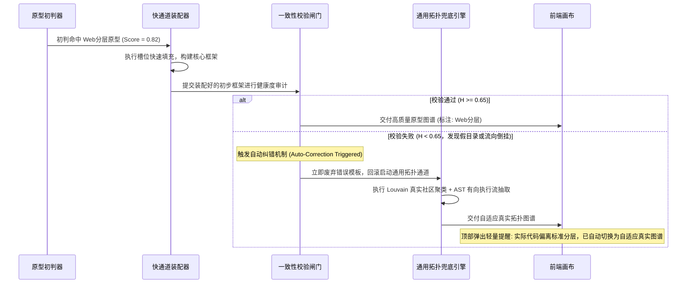
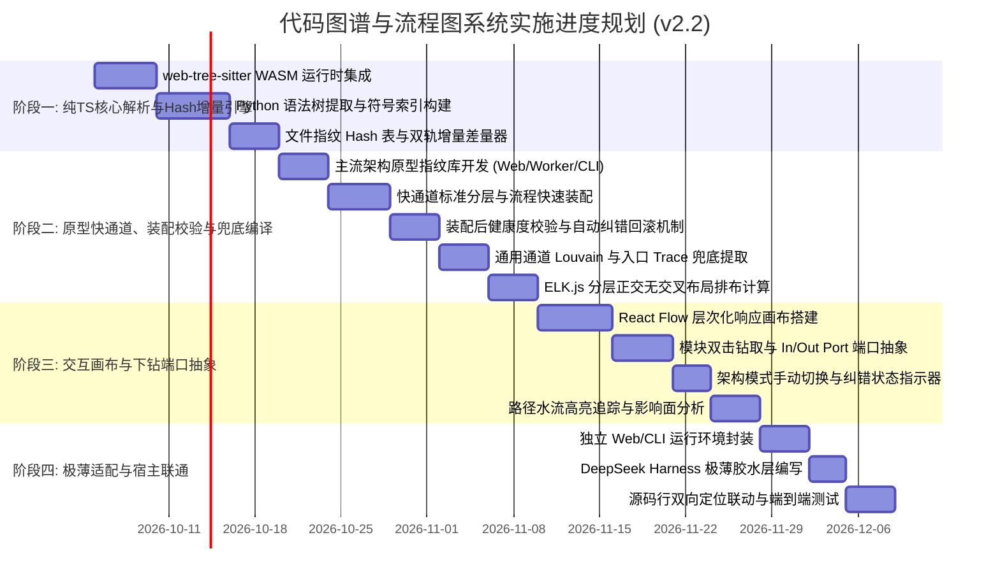

# DeepSeek Harness 代码图谱与架构流程图系统技术方案 (v2.2)

> **文件版本**：v2.2 (增加「装配后一致性校验与自动纠错回滚机制」版本)  
> **创建/修订日期**：2026-10-03  
> **核心修订**：
> 1. **内核独立解耦**：自包含轻量核心，配以极薄 DeepSeek Harness / IDE 适配层；
> 2. **主流架构原型快慢双通道引擎**：预置成熟程序架构模板（Web分层、异步Worker、CLI工具、微服务等），优先走「毫秒级快速匹配装配通道」；
> 3. **★ 装配后一致性校验与自动纠错回滚机制 (核心新增)**：针对“初判置信度 > 0.7 但组装后发现与实际代码严重冲突”的情况，建立健康度多维裁决算法，触发自动纠错、无缝回滚至通用拓扑通道，并在前端提供用户手动切换权；
> 4. **图流分离（彻底解决毛线团）**：分立「宏观架构依赖总线」与「入口时序执行流程图」，引入高频基础噪音过滤；
> 5. **纯粹技术栈 (TS + WASM)**：使用 `web-tree-sitter` (WASM)，纯单运行时，用户电脑零 Python 环境依赖；
> 6. **模块内钻取端口抽象**：硬件级 In/Out Port 端口与总线机制，隔离跨模块调用干扰；
> 7. **双轨增量引擎**：文件内容 Hash 为底层基石，Git 仅作为加速滤镜；
> 8. **用户按需掌控**：严格禁止静默自动全量扫描，提供路径范围选择器与显式触发按钮。

---

## 目录
1. [系统愿景与设计哲学](#一系统愿景与设计哲学)
2. [总体分层架构设计](#二总体分层架构设计)
3. [主流架构原型快慢双通道引擎](#三主流架构原型快慢双通道引擎)
4. [装配后一致性校验与自动纠错回滚机制 (核心新增)](#四装配后一致性校验与自动纠错回滚机制-核心新增)
5. [纯粹技术栈选型与运行模式](#五纯粹技术栈选型与运行模式)
6. [双模型图谱编译引擎 (彻底解决毛线团)](#六双模型图谱编译引擎-彻底解决毛线团)
7. [模块内钻取与端口总线机制 (Port & Bus)](#七模块内钻取与端口总线机制-port--bus)
8. [双轨增量同步引擎 (Hash + Git)](#八双轨增量同步引擎-hash--git)
9. [用户按需触发与多场景控制](#九用户按需触发与多场景控制)
10. [极薄 DeepSeek Harness 适配器规范](#十极薄-deepseek-harness-适配器规范)
11. [数据契约与统一图谱 Schema](#十一数据契约与统一图谱-schema)
12. [分阶段实施路线图 (Milestones)](#十二分阶段实施路线图-milestones)

---

## 一、 系统愿景与设计哲学

在现代 AI 辅助编程中，开发者与 AI Agent 需要真正理解代码的**逻辑时序与交互架构**，而非仅仅磁盘上的文件层级。本系统致力于打造一个**0-Token 本地运行、毫秒级响应、架构与流程合一**的下一代交互式代码图谱。

### 核心设计哲学
1. **经验原型优先，智能校验纠错，通用算法兜底（Archetype-First with Self-Correction & Fallback）**：针对成熟工业范式（Web分层、Worker任务、CLI等）采用预置模板极速拼配；拼配完成后必须经过严密的一致性校验，一旦发现代码实际行为与预设违背，立即自动无缝纠错回滚；
2. **内核独立，适配器极薄**：核心引擎具备 100% 独立运行能力（CLI/Web），通过极薄胶水层挂载到 DeepSeek Harness 或其它 IDE；
3. **图流分离，告别毛线团**：明确分离**“宏观依赖架构图”**与**“入口时序流程图”**，用有时序的流程思维组织代码执行链路；
4. **环境零依赖，开箱即用**：采用 TypeScript + WASM 统一运行时，消除“用户电脑缺环境/缺库”导致的崩溃，单包分发；
5. **稳定基石，按需克制**：以文件 Hash 为增量基石，Git 为加速手段；严格尊重用户意图，禁止未授权的后台全盘狂扫。

---

## 二、 总体分层架构设计

```mermaid
flowchart TD
    subgraph HostLayer [宿主与运行环境 (Host Layer)]
        StandAlone[独立运行模式 CLI / Web]
        HarnessPlugin[DeepSeek Harness 极薄适配层]
    end

    subgraph ScopeGate [用户控制与范围网关]
        ScopeSelector[扫描目录选择器 Scope Path]
        TriggerButton[显式全量扫描触发按钮]
        IncrementalWatcher[双轨增量感知器: Hash索引 + Git状态]
    end

    subgraph CoreEngine [自包含核心图谱引擎 (TypeScript/WASM)]
        subgraph ParserPipeline [0-Token 纯本地多语言解析]
            TreeSitterWasm[web-tree-sitter WASM 语法分析]
            PyGrammar[Python 语法适配 (Phase 1)]
        end

        subgraph ArchetypeClassifier [架构原型特征识别器]
            PatternDetector{初判置信度 ≥ 0.70 ?}
        end

        subgraph FastPath [快速通道: 预置架构与标准流程模板]
            WebArchetype[Web分层模板]
            WorkerArchetype[任务队列模板]
            CliArchetype[CLI管道模板]
            FastAssembler[原型槽位快速填充器]
            
            subgraph VerifyGate [装配后一致性校验与纠错闸门]
                ConsistencyChecker{综合健康度 H ≥ 0.65 ?}
            end
        end

        subgraph SlowPath [通用通道: 拓扑图挖掘兜底算法]
            SymbolIndexer[全局符号与定义引用索引]
            LouvainClustering[Louvain 拓扑社区发现]
            TracePathfinder[入口有向可达性路径抽取]
            NoiseFilter[高频基础节点降噪]
        end

        subgraph LayoutEngine [分层正交排布系统]
            ELKLayout[ELK.js / Sugiyama 布局算法]
        end
    end

    subgraph PresentationLayer [前端多尺度交互画布]
        CanvasUI[React Flow / XYFlow 响应式画布]
        ArchView[视图1: 模块框架与依赖总线]
        FlowView[视图2: 业务时序主干流]
        DrillView[视图3: 模块内钻取 + In/Out Port]
        OverrideSwitch[顶部交互: 原型手动切换与纠错指示器]
    end

    HostLayer --> ScopeGate
    TriggerButton --> ScopeSelector
    ScopeSelector --> ParserPipeline
    IncrementalWatcher --> ParserPipeline
    ParserPipeline --> ArchetypeClassifier

    PatternDetector -->|是| FastPath
    FastPath --> FastAssembler
    FastAssembler --> VerifyGate

    VerifyGate -->|校验通过| LayoutEngine
    VerifyGate -->|校验失败 (自动纠错回滚)| SlowPath

    PatternDetector -->|否 (直接走通用)| SlowPath
    SlowPath --> LayoutEngine

    LayoutEngine --> PresentationLayer
    OverrideSwitch -.->|用户手动强制重设| FastPath
    OverrideSwitch -.->|用户手动强制重设| SlowPath
```

---

## 三、 主流架构原型快慢双通道引擎

为了极大节省全量图挖掘的工作量与计算延迟，同时呈现出如架构师手绘般优雅直观的图谱，系统引入**“原型匹配快通道 + 通用拓扑降级兜底”**机制。

### 3.1 预置的 4 大主流架构原型库 (Archetype Library)

#### 原型 1：经典 Web 分层架构 (Layered / MVC / Hexagonal Archetype)
* **特征指纹识别**：
  - 依赖库：检测到 `fastapi`, `flask`, `django`, `tornado` 等；
  - 目录模式：包含 `routers/`, `controllers/`, `views/`, `services/`, `models/`, `schemas/`, `dao/`, `repositories/` 等经典目录名；
* **预制架构形态**：三层标准方块容器（表现层 Presentation ➔ 业务逻辑层 Domain/Service ➔ 基础设施与数据层 Data/Infra）；
* **预制流程模式**：
  $$\text{HTTP Request} \longrightarrow \text{Middleware / Auth} \longrightarrow \text{Router Handler} \longrightarrow \text{Service Logic} \longrightarrow \text{Repository / ORM} \longrightarrow \text{DB / Cache} \longrightarrow \text{Response}$$

#### 原型 2：异步任务队列与事件驱动架构 (Worker & Pipeline Archetype)
* **特征指纹识别**：
  - 依赖库：检测到 `celery`, `redis`, `kafka`, `pika` (RabbitMQ), `rq` 等；
  - 目录模式：包含 `tasks/`, `workers/`, `queues/`, `producers/`, `consumers/`, `events/`；
* **预制架构形态**：三段式流转拓扑（生产者触发端 ➔ 消息中间件/队列 ➔ 工作进程消费端 ➔ 结果落盘）；
* **预制流程模式**：
  $$\text{Event / API Trigger} \longrightarrow \text{Task Enqueue} \longrightarrow \text{Broker Buffer} \longrightarrow \text{Worker Consumer} \longrightarrow \text{Handler Execution} \longrightarrow \text{Result Backend}$$

#### 原型 3：CLI 工具与 ETL 数据管道架构 (Command & Data Pipeline Archetype)
* **特征指纹识别**：
  - 依赖库：检测到 `click`, `typer`, `argparse`, `fire`, `pandas`；
  - 目录模式：包含 `cli/`, `commands/`, `pipeline/`, `steps/`, `parsers/`，且有 `__main__.py` 或入口脚本；
* **预制架构形态**：线形步骤管道拓扑（输入解析 ➔ 参数校验 ➔ 步骤流水线 Pipeline ➔ 输出格式化）；
* **预制流程模式**：
  $$\text{CLI Invocation} \longrightarrow \text{Args Parser} \longrightarrow \text{Command Dispatcher} \longrightarrow \text{Step 1 (Extract)} \longrightarrow \text{Step 2 (Transform)} \longrightarrow \text{Step 3 (Load/Output)}$$

#### 原型 4：独立库 / SDK 导出架构 (Library / SDK Archetype)
* **特征指纹识别**：
  - 结构：以 `__init__.py` 或 `index.ts` 集中显式暴露对外 API，内部包含 `core/`, `utils/`, `internal/`；
* **预制架构形态**：核心引擎卡片 + 对外导出接口卡片 + 底层工具卡片。

---

## 四、 装配后一致性校验与自动纠错回滚机制 (核心新增)

### 4.1 为什么要设计纠错机制？
虽然初始目录与依赖特征可能给出很高的置信度（如 $Score \ge 0.70$），但在实际工程中常常存在以下“货不对板”的现象：
1. **空壳/假目录现象**：项目有 `services/` 目录，但里面只是空文件或废弃代码，实际所有业务逻辑都在 `routers/` 里一锅端；
2. **反向调用/逆流违背**：表面是 Web 分层架构，但实际代码中模型层（Models）直接调用了控制器（Routers），调用流向倒挂率超过 40%；
3. **大量孤儿代码漂移**：套用预制模板后，发现项目中 60% 以上的核心函数无法被塞入预置的原型槽位，飘在容器外成为孤岛。

如果此时强行按照预设模板展示，就会产生严重误导！因此**构建完核心框架后，必须有一道严格的装配后健康度校验闸门**。

---

### 4.2 三维装配健康度裁决模型 ($H_{archetype}$)

在槽位装配完成后，执行毫秒级拓扑一致性审计，计算综合健康度得分 $H$：

$$H = w_1 \cdot S_{\text{fill}} + w_2 \cdot S_{\text{flow}} + w_3 \cdot S_{\text{coverage}}$$

* **1. 槽位有效填充率 ($S_{\text{fill}}$，权重 $w_1 = 0.35$)**：
  - 检查预置原型的核心关键槽位是否真实被填入代码符号；
  - 例：Web 原型必须至少包含有效路由入口（Controller）与数据操作；若核心层槽位为空，得分归零。
* **2. 流程流向顺应率 ($S_{\text{flow}}$，权重 $w_2 = 0.40$)**：
  - 统计实际 AST 调用边中，符合原型预设方向（如 $L_1 \to L_2 \to L_3$）的比例；
  - 若反向逆流调用或跨层乱调的比例超过 35%，该项得分严重扣减。
* **3. 符号覆盖捕获率 ($S_{\text{coverage}}$，权重 $w_3 = 0.25$)**：
  - 被当前原型容器成功接纳的符号数占全工程总活跃符号数的比例；
  - 若大量核心业务代码游离于模板之外，说明该模板无法代表当前系统真实全貌。

---

### 4.3 自动纠错与平滑回滚流程 (Auto-Rollback)



---

### 4.4 前端用户手动纠错与覆盖控件 (User Override)
虽然系统具备全自动纠错能力，但仍然将最终的裁决权归还给开发者。

在画布顶部的控制栏中，提供醒目的 **【架构模式切换器】**：
* 默认显示当前选中的模式，例如：
  - `[ 🏷️ 架构布局: Web分层原型 (自动匹配) ▾ ]` 或
  - `[ ⚠️ 架构布局: 自适应真实拓扑 (自动纠错回滚) ▾ ]`
* 用户随时可以点击下拉框进行手动强制纠错：
  - 强制应用【Web 分层架构】
  - 强制应用【异步任务队列】
  - 强制应用【CLI 数据管道】
  - 强制应用【自适应真实拓扑 (通用)】
  - 强制应用【纯物理文件树分层】
* 切换后立即就地重绘，杜绝任何算法误判造成的困扰。

---

## 五、 纯粹技术栈选型与运行模式

彻底消除“Node.js 调 Python 子进程”的跨语言脆弱通信架构，采用**纯 TypeScript + WASM** 的现代化单运行时体系：

| 模块 | 选型方案 | 核心优势 |
| :--- | :--- | :--- |
| **AST 解析引擎** | **`web-tree-sitter` (WASM)** | 1. 纯 Node.js / 浏览器双端通用，**完全不需要用户安装 Python 环境**；<br>2. 性能极高（C 核心编译为 WebAssembly，解析速度比 Python 原生 AST 快 3~5 倍）；<br>3. 原生支持 50+ 门主流语言，后续扩展 TS、Go、Java、C/C++ 仅需载入对应的 `.wasm` 语法包，架构完全一致。 |
| **图数据结构与算法** | **`graphology` + `graphology-communities-louvain`** | JS/TS 生态中性能最强的图算法库，毫秒级完成数千个节点的 Louvain 社区聚类与最短路径遍历。 |
| **布局排布引擎** | **`elkjs` (Eclipse Layout Kernel)** | 成熟工业级分层有向图布局，原生生成干净的正交对齐折线与分层方块。 |
| **交互前端画布** | **`@xyflow/react` (React Flow) + Tailwind CSS** | 原生支持子图嵌套（Subflows）、动态端口（Handles）、节点展开/折叠与视口平滑缩放。 |

---

## 六、 双模型图谱编译引擎 (彻底解决毛线团)

为了彻底解决“AST 网状毛线团不能当作流程图”的行业通病，系统内部独立编译两套视图模型：

```
                    源码 AST 抽象语法树
                           │
             ┌─────────────┴─────────────┐
             ▼                           ▼
    【模型 1: 架构拓扑模型】     【模型 2: 业务时序流模型】
    - 实体: 逻辑模块 / 社区     - 实体: 业务步骤 / 函数节点
    - 边: 模块依赖总线 (Bus)     - 边: 时序调用流 (1 ➔ 2 ➔ 3)
    - 关注点: 结构边界与解耦     - 关注点: 谁触发谁，数据怎么走
```

### 6.1 模型 1：宏观架构拓扑图 (Architecture Topology)
* **目的**：展示整个系统的模块划分、边界与耦合关系；
* **聚类归约**：运行 Louvain 算法将零散文件归纳为若干个“业务模块方块（Container Cards）”；
* **总线抽象（Dependency Bus）**：如果模块 A 内部有 15 个函数调用了模块 B 内部的 8 个函数，在宏观层**绝不画 120 条连线**，而是折叠为一条带有计数和协议标注的**模块依赖总线（Module-to-Module Bus，标注：15 calls）**。

### 6.2 模型 2：入口时序流程图 (Execution Trace Flow)
* **目的**：像流程图一样呈现业务的真实运转脉络；
* **步骤一：自动识别起点（Entry Points）**：
  - Web 路由：`@app.get(...)`、`@router.post(...)`、Flask/Django 端点；
  - CLI 命令：`@click.command()`、`argparse` 分发函数；
  - 任务与事件：Celery task、Kafka/Redis consumer、`main()` 函数；
* **步骤二：正向可达性遍历（Forward Trace Pathfinder）**：
  - 从用户选定的或自动探测的 Entrypoint 出发，沿 `CALLS` 边做深度/广度有向追踪，提取出有头有尾的主干执行树；
* **步骤三：噪音抑制过滤（Noise Dampener）**：
  - **规则降噪**：系统自动识别“泛滥调用节点”（如 `logger.info`、`config.get`、`utils.format_date` 等入度极高的底层辅助函数）；
  - 将这些通用节点从主流程线中抽离，转为节点内部的标签附注，保证业务流程主干清晰呈现。

---

## 七、 模块内钻取与端口总线机制 (Port & Bus)

解决“点击进入模块内部查看详细代码交互”的关键交互闭环：

```
+---------------------- 模块 A (AuthModule) ----------------------+
|                                                                |
|  [ In-Port: /api/login ] ──────┐                               |
|                                ▼                               |
|                       verify_credentials()                     |
|                                │                               |
|                                ▼                               |
|                        generate_token()                        |
|                                │                               |
|                                ├─────────► [ Out-Port: Redis ] |
|                                ▼                               |
|                      [ Out-Port: Postgres ]                    |
+----------------------------------------------------------------+
```

1. **进入模块内部（Semantic Zoom-in）**：
   - 双击模块卡片，画布平滑下钻进入该模块的独立视图，顶端生成多级面包屑；
   - 展现该模块内部具体的类（Class）、方法（Method）与函数（Function）的细粒度调用关系；
2. **虚拟边缘端口（Port Abstraction）**：
   - **外部调用打入该模块**：在模块左边缘生成 `In-Port`（例如外部路由调用入口）；
   - **该模块向外调用其他模块**：在模块右边缘生成 `Out-Port`（例如向外调用 `UserDb.query`），连线指向该端口而不是把外部庞大的依赖图生拉硬拽进来；
   - 点击 `Out-Port` 端口，可顺藤摸瓜一键平移跳转到目标模块。
3. **源码双向联动**：
   - 单击内部函数节点：右侧展开微型代码预览卡片；
   - 双击或点击跳转图标：IDE 编辑器直接光标精准定位到本地文件对应行（`file:///...#L42`）。

---

## 八、 双轨增量同步引擎 (Hash + Git)

彻底解决“没有 Git 就失效”的致命缺陷，打造坚如磐石的双轨增量机制：

```mermaid
flowchart LR
    FileChange[文件变动事件] --> GitCheck{检测当前工程是否为 Git 仓库?}
    GitCheck -->|是| GitDiffFilter[Git Status/Diff 快速过滤变动路径]
    GitCheck -->|否| HashCompare[文件 mtime 与 SHA-256 哈希比对]
    GitDiffFilter --> ScopeVerify[验证变动文件是否在用户指定的 Scope 目录内]
    HashCompare --> ScopeVerify
    ScopeVerify -->|在范围内| ASTPatch[局部重析 AST 并手术式缝合全局图谱]
    ScopeVerify -->|不在范围内| Ignore[直接丢弃忽略]
    ASTPatch --> IncrementalLayout[局部坐标微调更新 (防跳动)]
```

1. **第一轨：文件指纹基石（Content Hash Table）**：
   - 为扫描范围内的每个文件建立 `hash_map = { file_path: sha256_hash }`；
   - 即使项目完全没有 Git，只要文件被编辑修改，比对哈希即可毫秒级识别出脏文件，**单文件增量更新延迟 ≤ 30ms**；
2. **第二轨：Git 差异加速器（Git Diff Fast-Path）**：
   - 若项目存在 `.git`，优先通过 `git status --porcelain` 瞬时获取脏文件列表，避免在大项目中全盘扫磁盘文件；
3. **视觉布局锚定（Layout Pinning）**：
   - 局部更新时锁定未改动模块的绝对坐标，仅对发生变动的容器内部做平滑微动画调整，防止视图跳跃。

---

## 九、 用户按需触发与多场景控制

系统坚决执行**“非请勿扰（Never Scan Silently）”**原则，适配各种工程场景：

### 9.1 五类典型场景自适应策略
| 场景类型 | 默认行为 | 用户操作路径 |
| :--- | :--- | :--- |
| **1. 临时小脚本 / HTML 前端** | 彻底静默，0 CPU / 内存占用 | 用户无需任何操作，插件如同不存在 |
| **2. 历史已有项目** | 静默待命，展示配置卡片 | 用户按需选择是否生成，或直接查看历史已有缓存 |
| **3. 外部克隆的开源大项目** | 阻止全盘盲目扫描 | 用户在路径框输入 `./src` 或 `./backend`，只分析核心业务，忽略外围海量 tests/docs |
| **4. 新建空项目** | 静默待命 | 开发者写完初步骨架后，主动点击按钮确立第一版基线 |
| **5. Monorepo 单体大仓** | 细粒度子目录限定 | 自定义指定子包路径（如 `./packages/core`）进行局部建图 |

---

## 十、 极薄 DeepSeek Harness 适配器规范

为了兼顾通用性与对 DeepSeek Harness 的原生支持，系统拆分为 **核心引擎** 与 **极薄适配层**，严格遵守代码物理隔离原则：
* **核心代码库 (Code Space)**：所有的 AST 语法分析、图谱算法、布局计算、Webview 前端组件及 CLI 均完整保存在插件项目内；
* **宿主集成目标 (DSH Desktop)**：
  - 宿主安装位置：DeepSeek Harness 安装目录 (DSH Desktop 运行时)；
  - 配置文件注入位置：`~/.dsh/profiles/desktop/cordis.patch.yml`；
  - 接入方式：通过插件软链或 npm 声明，在 DSH 会话界面注入代码图谱专属标签页，核心业务逻辑完全不侵入 DSH 安装目录。

### 10.1 目录组织结构
```
codegraph-studio/
├── packages/
│   ├── core/                      # 【100% 独立内核 (TypeScript)】
│   │   ├── parser/                # 基于 web-tree-sitter 的多语言 AST 提取器
│   │   ├── archetype/             # 架构原型特征识别器、模板库与健康度校验器
│   │   ├── graph/                 # 符号索引、Louvain 聚类、双模型编译器
│   │   ├── layout/                # ELK.js 分层正交排布计算
│   │   └── watcher/               # Hash + Git 双轨增量同步器
│   │
│   ├── webview/                   # 【独立前端交互画布 (React + Tailwind)】
│   │   ├── components/            # 架构图卡片、流程图节点、In/Out Port 端口、模式切换器
│   │   └── canvas/                # 支持多尺度缩放与钻取的 React Flow 主画布
│   │
│   └── harness-adapter/           # 【极薄 DeepSeek Harness 胶水层 (Cordis 插件)】
│       ├── package.json           # 仅声明 dsh.bundle.patch
│       ├── cordis.patch.yml       # 挂载到 DSH desktop profile
│       └── src/
│           ├── index.ts           # 极简 apply(ctx): 仅做两件事 (挂载Webview + 注册AgentTool)
│           └── tools.ts           # 向 DeepSeek 模型暴露 query_code_graph 工具
```


---

## 十一、 数据契约与统一图谱 Schema

```json
{
  "$schema": "https://codegraph.local/schemas/v2.json",
  "meta": {
    "project_name": "example-service",
    "scope_path": "src/backend",
    "detected_archetype": "WEB_LAYERED_FASTAPI",
    "initial_confidence": 0.92,
    "post_verify_health": 0.88,
    "is_auto_corrected": false,
    "generated_at": "2026-10-03T14:15:00Z"
  },
  "architecture_view": {
    "modules": [
      {
        "id": "mod_auth",
        "name": "AuthModule",
        "files_count": 6,
        "in_ports": ["login_endpoint", "refresh_endpoint"],
        "out_ports": ["user_db_query", "redis_token_store"]
      }
    ],
    "buses": [
      {
        "source": "mod_auth",
        "target": "mod_user",
        "call_count": 12,
        "protocols": ["INTERNAL_CALL"]
      }
    ]
  },
  "process_flows": [
    {
      "flow_id": "flow_user_login",
      "entry_point": "src/backend/api/auth.py:login",
      "steps": [
        { "id": "s1", "name": "validate_payload", "type": "STEP" },
        { "id": "s2", "name": "query_user_by_email", "type": "STEP", "module": "mod_user" },
        { "id": "s3", "name": "verify_hash", "type": "DECISION" },
        { "id": "s4", "name": "issue_jwt", "type": "STEP" }
      ],
      "edges": [
        { "source": "s1", "target": "s2" },
        { "source": "s2", "target": "s3" },
        { "source": "s3", "target": "s4", "condition": "valid == true" }
      ]
    }
  ]
}
```

---

## 十二、 分阶段实施路线图 (Milestones)



### 交付物验收指标
1. **Milestone 1**：纯 Node/TS 命令行工具，无需安装 Python，1 秒内完成包含 50+ 个 Python 文件的 AST 符号抽取与 Hash 增量检测；
2. **Milestone 2**：
   - 命中 Web/Worker/CLI 原型时，50ms 内完成快速装配；
   - **纠错兜底验证**：面对人为构造的“假目录”或“流向倒挂”异常项目，校验闸门准确识别并在 20ms 内自动回滚降级至通用真实拓扑；
3. **Milestone 3**：前端画布流畅运行，双击模块卡片平滑进入下钻视窗，边缘整齐呈现 In/Out Port 端口，顶部提供原型手动覆盖切换器；
4. **Milestone 4**：作为轻量插件挂载到 DeepSeek Harness，同时支持在普通浏览器中独立启动。
